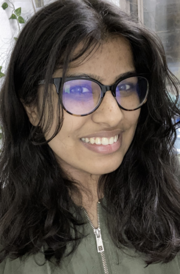
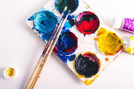

Hi, my name is Fnu Anu and I am a 2nd-year CS major at Thurgood Marshall.



# *My Hobbies*
## ~~BRAINROT~~ *oopsie*

  ***My favorite ways to brainrot I personally recommend:***
- Skribl.io w/ friends
- TikTok
- Youtube Shorts

<ins>NOTE: I am a huge foodie, an  absolute sucker for good Indian and Thai cuisine.</ins>

## Volunteer @ Ronald McDonald House and Rady's Children Hospital

## Research @ Dr. Sahoo and Dr. Tolley lab
   
## Reading Books
- I love reading historical thriller and romance webtoons.
- My favorite dramatic book was Great Gatsby.

## Art



The best way to decribe my adventures is:
YOLO
> You only live once - Mae West


Some simple code that I started with originally was:
```
print("Hello World") //printing
```

A program I was really involved in during high school was [Simon Scholars Program](https://simonscholars.org/).

Link to reading: [Link Text](#reading-books).

[Paint image in repo](main/Paint.png)
